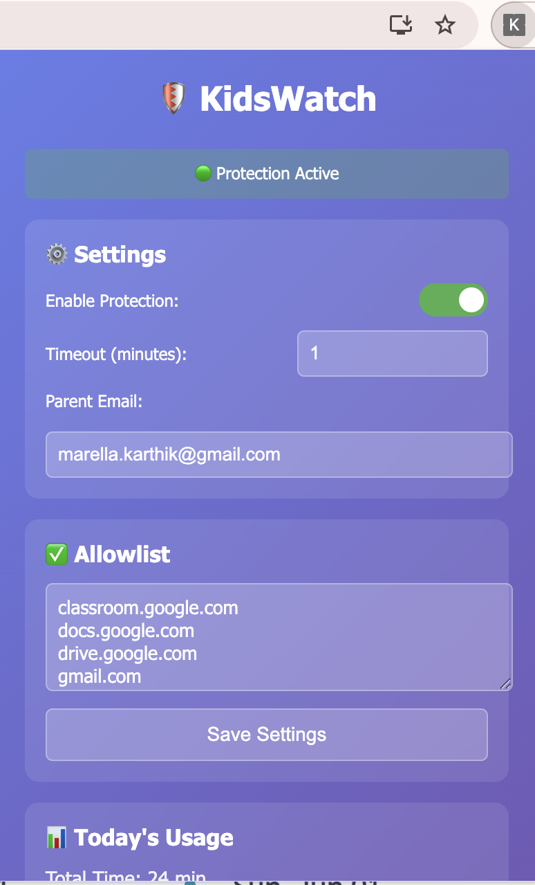
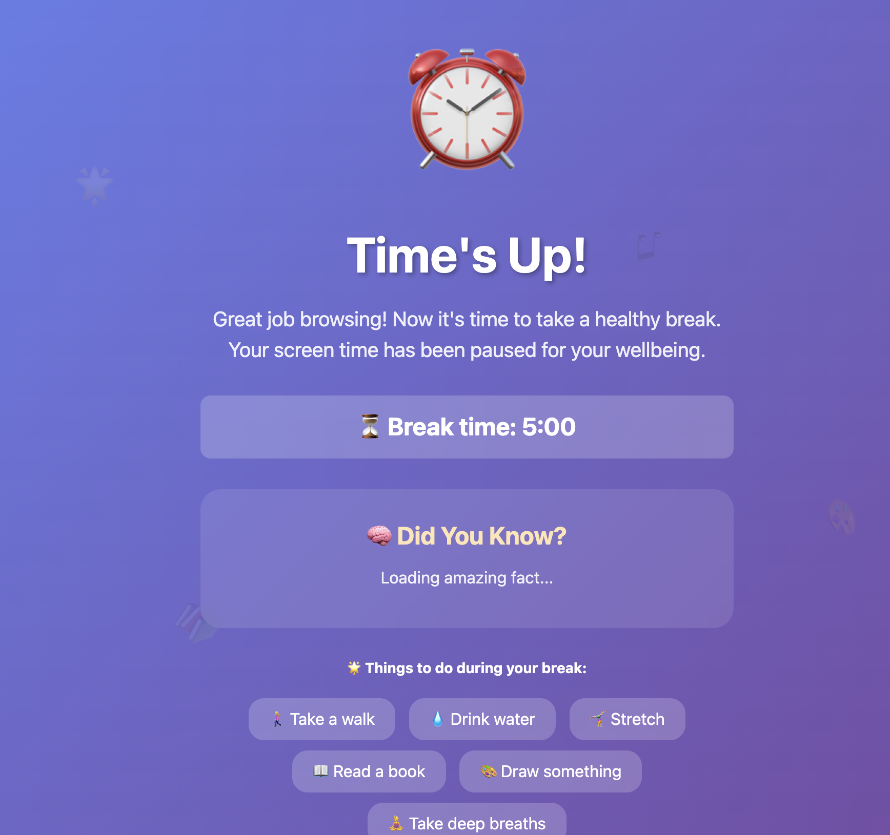
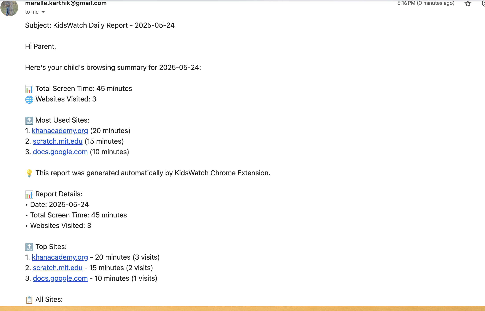

# 🛡️ KidsWatch Chrome Extension

## 📦 Ready-to-Install Chrome Extension

**Get the complete extension from GitHub:** [https://github.com/Kmaralla/kids-screen-monitor](https://github.com/Kmaralla/kids-screen-monitor)

## What You Get
✅ **Website Time Tracking** - Monitors time spent on each site  
✅ **5-minute Timeout** - Blocks non-allowed sites after 5 minutes  
✅ **Smart Allowlist** - Pre-configured with educational sites  
✅ **Beautiful UI** - Easy-to-use parent dashboard  
✅ **Real Email Reports** - Automatic daily reports via EmailJS  
✅ **Gentle Enforcement** - Kid-friendly timeout screen with activities  
✅ **Complete Setup** - All files included, ready to install

## 📸 Screenshots

### Extension Dashboard

*Beautiful parent dashboard with real-time usage stats and easy controls*

### Kid-Friendly Timeout Screen  

*Gentle enforcement with educational activities and positive messaging*

### Chrome Extensions Page

*Easy installation - just load unpacked and you're ready to go*

### Email Report Sample

*Professional daily reports delivered directly to your inbox*

> 📝 **Note**: Screenshots will be added once you take them using the guide in `screenshots/README.md`

## Installation Steps

### 1. 📥 Download from GitHub

**Option A: Clone with Git (Recommended)**
```bash
git clone https://github.com/Kmaralla/kids-screen-monitor.git
cd kids-screen-monitor
```

**Option B: Download ZIP**
1. Go to [https://github.com/Kmaralla/kids-screen-monitor](https://github.com/Kmaralla/kids-screen-monitor)
2. Click the green **"Code"** button
3. Click **"Download ZIP"**
4. Extract the ZIP file to a folder on your computer

### 2. 🚀 Install in Chrome

1. Open Chrome and go to `chrome://extensions/`
2. Turn on **Developer mode** (toggle in top right)
3. Click **Load unpacked**
4. Select the `kids-screen-monitor` folder (the one containing `manifest.json`)
5. The KidsWatch extension should now appear in your extensions list

### 3. ⚙️ Initial Setup
1. Click the KidsWatch icon in your Chrome toolbar
2. **Enable Protection** - Toggle to ON
3. **Set Parent Email** - Enter your email for daily reports
4. **Configure Allowlist** - Edit allowed sites (pre-configured with educational sites)
5. **Save Settings**

### 4. 📧 Email Setup (Required for Reports)
To receive daily email reports, you need to set up EmailJS (free):

#### Step 4.1: Create EmailJS Account
1. Go to [https://www.emailjs.com](https://www.emailjs.com)
2. Sign up for a free account (up to 200 emails/month)
3. Verify your email address

#### Step 4.2: Add Email Service
1. In EmailJS dashboard, go to **"Email Services"**
2. Click **"Add New Service"**
3. Choose **Gmail** (recommended) or your preferred provider
4. Follow the setup wizard to connect your email
5. Note down your **Service ID** (e.g., `service_abc123`)

#### Step 4.3: Create Email Template
1. Go to **"Email Templates"** in EmailJS dashboard
2. Click **"Create New Template"**
3. Use this template content:

```
Subject: KidsWatch Daily Report - {{report_date}}

Hi {{to_name}},

{{message}}

📊 Report Details:
• Date: {{report_date}}
• Total Screen Time: {{total_time}}
• Websites Visited: {{sites_count}}

🔝 Top Sites:
{{top_sites}}

📋 All Sites:
{{all_sites}}

---
Generated by KidsWatch Chrome Extension
```

4. Save the template and note down your **Template ID** (e.g., `template_xyz789`)

#### Step 4.4: Get Public Key
1. Go to **"Account"** section in EmailJS dashboard
2. Find your **Public Key** (e.g., `user_def456`)

#### Step 4.5: Configure Extension
1. Click the KidsWatch extension icon
2. Click **"Test Email Report"**
3. When prompted, enter your EmailJS credentials:
   - **Service ID**: From step 4.2
   - **Template ID**: From step 4.3  
   - **Public Key**: From step 4.4
4. Click **"Test Email Report"** again to send a test email
5. Check your inbox for the test report!

## Pre-configured Allowed Sites
- classroom.google.com
- docs.google.com  
- drive.google.com
- gmail.com
- khanacademy.org
- duolingo.com
- scratch.mit.edu

## How It Works

### For Kids:
- Browse normally on allowed sites with no restrictions
- On other sites, get a 5-minute timer
- Friendly warning at 2 minutes remaining
- Beautiful break screen with activities and fun facts
- 5-minute break before returning to browsing

### For Parents:
- Real-time dashboard showing today's usage
- **Automatic daily email reports** (generated at 6 PM)
- Easy allowlist management
- Enable/disable protection as needed
- Test email functionality anytime

## Features Overview

### 📊 Dashboard
- Today's total screen time
- Sites visited with time breakdown
- Quick settings access
- Email status indicators

### ⏰ Smart Timeouts  
- 5-minute limit on non-allowed sites
- Progressive warnings (2 min, 1 min, 30 sec)
- Educational timeout screen with:
  - Fun facts for kids
  - Activity suggestions
  - 5-minute break timer

### 📧 Real Email Reports
- **Automatic daily reports at 6 PM**
- Beautiful HTML email format
- Total time spent online
- Top 5 most visited sites
- Site visit counts and time breakdown
- **Test email functionality**

### 🎨 Kid-Friendly Design
- Colorful, engaging interface
- Positive messaging
- Educational content during breaks
- No shame or punishment language

## Email Report Sample

Your daily reports will look like this:

```
Subject: KidsWatch Daily Report - 2024-05-24

Hi Parent,

Here's your child's browsing summary for 2024-05-24:

📊 Total Screen Time: 1 hour and 25 minutes
🌐 Websites Visited: 5

🔝 Most Used Sites:
1. khanacademy.org (35 minutes)
2. scratch.mit.edu (25 minutes)
3. docs.google.com (15 minutes)

💡 This report was generated automatically by KidsWatch Chrome Extension.
```

## Troubleshooting

**Extension not working?**
- Make sure Developer mode is enabled
- Check that all files are in the same folder
- Refresh the extension in chrome://extensions/
- Get the latest version from [GitHub](https://github.com/Kmaralla/kids-screen-monitor)

**Not blocking sites?**
- Verify Protection is enabled in settings
- Check that the site isn't in your allowlist
- Try refreshing the page

**No daily reports?**
- Ensure parent email is set and saved
- **Complete EmailJS setup** (see step 4 above)
- Click "Test Email Report" to verify setup
- Reports generate at 6 PM daily
- Check spam/junk folder

**Email setup issues?**
- Verify EmailJS credentials are correct
- Check EmailJS dashboard for sending limits
- Ensure Gmail (or your provider) is properly connected
- Try sending a test email from EmailJS dashboard first

**Need help or found a bug?**
- Check the [GitHub repository](https://github.com/Kmaralla/kids-screen-monitor) for updates
- Open an issue on GitHub for support

## Technical Notes
- Very lightweight (~5-10MB memory usage)
- **Real email functionality** via EmailJS API
- Stores all data locally on the device
- No external servers or tracking (except EmailJS for emails)
- Chrome Web Store submission ready
- Free email service (200 emails/month with EmailJS)

## Next Steps (Future Phases)

**Phase 2 Ideas:**
- Smart categorization (educational vs entertainment)
- Different time limits per category  
- Earn extra time through educational activities
- Weekly family digital wellness reports

**Phase 3 Ideas:**
- AI-powered content analysis
- Achievement badges for good habits
- Family screen time competitions
- Advanced analytics and insights

## Support
✅ **Phase 1 Complete** - Full email integration included!

Future iterations can add more sophisticated reporting and additional parental controls based on your feedback!

Perfect for Chromebooks - designed specifically for resource-constrained devices. 🚀

---

## 🔧 For Developers

### Files Structure:
```
📁 kids-screen-monitor/
├── 📄 manifest.json (Extension configuration)
├── 📄 README.md (This file)
├── 📁 js/
│   ├── 📄 background.js (Service worker)
│   ├── 📄 content.js (Content script)
│   ├── 📄 popup.js (UI logic)
│   └── 📄 emailService.js (EmailJS integration)
├── 📁 html/
│   ├── 📄 popup.html (Extension popup)
│   └── 📄 timeout.html (Timeout screen)
├── 📁 css/ (Optional stylesheets)
├── 📁 icons/ (Extension icons)
└── 📁 screenshots/ (Documentation images)
```

### Email Service Integration:
- Uses EmailJS for client-side email sending
- No backend server required
- Free tier: 200 emails/month
- Secure API key management via Chrome storage 
